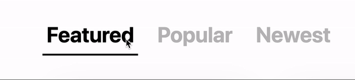

# angular-sliding-tabs

## Installation
### npm
```bash
npm i angular-sliding-tabs
```

## Example
```typescript
// app.module.ts
import { SlidingTabsModule } from  'angular-sliding-tabs';

@NgModule({
  imports: [
    SlidingTabsModule // add SlidingTabsModule to your imports
  ]
})
export class AppModule {}
```

```html
<!-- app.component.html -->
<sliding-tabs
	(tabChanged)="tabClicked($event)"
	[tabs]="['Featured', 'Popular', 'Newest']"
	[size]="'h1'"
	[selectedTabStyle]="{color: 'green'}">
</sliding-tabs>
```

```typescript
// app.component.ts
export  class  AppComponent {
	tabClicked(tabName) {
		console.log(tabName);
	}
}
```

## API
### Bindable Properties
#### tabs
- Description
	- These are the names of the tabs
- Input
	- `string[]`
- Required? **YES**
- Example
	- `[tabs]="['Featured', 'Popular', 'Newest']"`
#### size
- Description
	- Used to determine tab size
- Input
	- `string`
	- Must be `'h1'`, `'h2'`, `'h3'`, or a specific font size (e.g. `'9px'`)
- Required? **No**
	- Default value: `'h1'`
- Example
	- `[size]="'h3'"`
	- `[size]="'32px'"`
#### selectedTabStyle
- Description
	- Style of the button that contains the text of the selected tab
- Input
	- Javascript `Object`
- Required? **No**
	- Default value: `{color: 'black'}`
- Example
	- `[selectedTabStyle]="{color: 'green'}"`
#### unselectedTabStyle
- Description
	- Style of the button that contains the text of the selected tab
- Input
	- Javascript `Object`
- Required? **No**
	- Default value: `null`
		- Unselected tabs will default to the `tab` css class if no value is provided
- Example
	- `[unselectedTabStyle]="{color: 'black'}"`
#### lineColor
- Description
	- The color of the line under the selected tab
- Input
	- `string`
- Required? **No**
	- Default value: `'black'`
- Example
	- `[lineColor]="'purple'"`

### Bindable Events
#### tabChanged
- Description
	- Event that calls a method from the parent component
- Input
	- `method`
	- Should pass a method with a parameter of `$event`
- Required? **No**
- Example
	- `(tabChanged)="tabClicked($event)"`

## License

MIT © Ander Moran